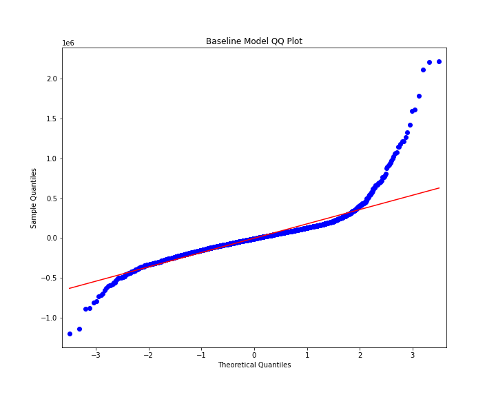
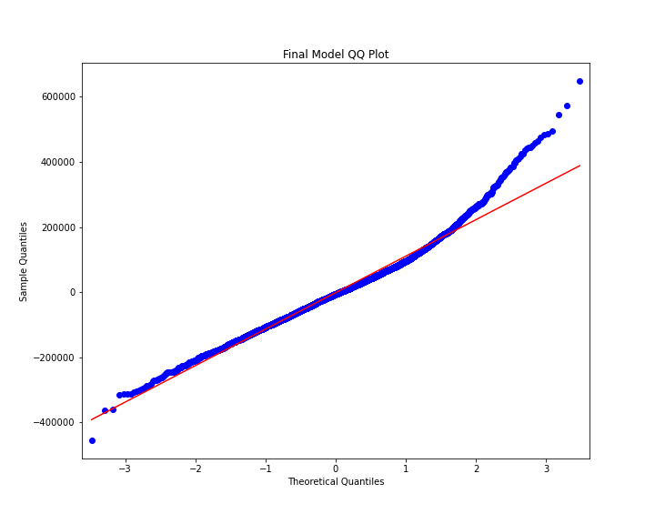

## A Glance into King County's Real Estate Market

Home's R Us is one of the top online marketplace for real estate that is along the west coast and are looking to expand their footprint into the Washington real estate market. In order for their platform to run optimally, their property listings need to accurately reflect the local market i.e. they need to know when their listings do not reflect prevailing market prices. They have tasked our team to create a predictive model to provide them with a baseline price of which they can expect to buy or sell homes within the King County Area

 ### Data

Data used in this project comes from King County's open source housing data from 2014 - 2015. The file can be found in the 'data' folder. Below are the relevant variables provided in the KC housing data file.

#### Column Names and descriptions for Kings County Data Set
* **id** - unique identified for a house
* **dateDate** - house was sold
* **pricePrice** -  is prediction target
* **bedroomsNumber** -  of Bedrooms/House
* **bathroomsNumber** -  of bathrooms/bedrooms
* **sqft_livingsquare** -  footage of the home
* **sqft_lotsquare** -  footage of the lot
* **floorsTotal** -  floors (levels) in house
* **waterfront** - House which has a view to a waterfront
* **view** - Has been viewed
* **condition** - How good the condition is ( Overall )
* **grade** - overall grade given to the housing unit, based on King County grading system
* **sqft_above** - square footage of house apart from basement
* **sqft_basement** - square footage of the basement
* **yr_built** - Built Year
* **yr_renovated** - Year when house was renovated
* **zipcode** - zip
* **lat** - Latitude coordinate
* **long** - Longitude coordinate
* **sqft_living15** - The square footage of interior housing living space for the nearest 15 neighbors
* **sqft_lot15** - The square footage of the land lots of the nearest 15 neighbors

The above columns are the variables used to predict home prices using a multi-variate regression model excluding price. The main variables that are of preliminary interest are sqft living, yr_built, and zipcode as many questions fielded about a prospecitve home include these variables.

## Business Problem

The main business concern for Homes R' Us is their ability to provide accurate pricing for clients who use their platform for buying and/or selling homes. In attempting to grow their footprint and enter Washington State's real estate market they would like to do their due diligence on prevailing real estate market before launching their service in Washington. By having accurate prices reflected on their online marketplace they are able to remain a trustworthy service for prospective home buyers and sellers, as well, increase traffic on their site all of which leading to higher quarterly revenues.

In order to deliver on our project, we needed to: 

1. Create a baseline model given our King County housing data mentioned above that predicts outputs price given all of the inputs above
2. Improve upon that baseline model to provide a more accurate predictive model for to better serve our clients needs
3. Determine what variables have the highest impact on home price

## Methods

### Preprocessing

Given the 2014-2015 King County Housing data, the first step was to preprocess our data i.e. clean it for missing values and problematic data types.

This entailed converting sqft basement form an object to an integer as the former would not be able to be handled in our regression model. There were are also two variables with 2k+ nan values which needed to be dealt with. For these, I filled the missing nan values at random given the respective probability weights and values for waterfront and yr_renovated variables.

### Transformation

I decided I also wanted to investigate yr_renovated and sqft basement as binary variables opposed to numerical ones so I created columns to reflect such using a lambda function.

To address Multicollinearity concerns, I needed to remove any independent variables that may have been correlated to each other which would have negatively affected the outcome of our regression model. In doing so, we removed the variable square foot above as it had a .88 correlation to sqft living and was above the correlation threshold of .75.

During this stage as well, dummy variables were created for our categorical variables, and additionally for variables that were on the fringe of being considered categorical variables such as bedrooms and bathrooms. This allowed us to consider both options when running our regressions

For our continuous variables, columns were created for log transformations and mean normalization, which will be touched on later but was to no avail.

Lastly, I dropped outliers for the continuous variables in the data as there were large tails and positive skew for such variables. To do so, I used a z-score approach to drop from 2-4 standard deviations for a given variable.

### Data Mining

In this stage most of the heavy lifting was done for our project. We ran our baseline model with cleaned data without any of our transformations and were able to get an R^2 of .700 and RMSE of .633 This is to say without any tweaks our model was able to expalin 70% of the change in Y(price)

Then many iterations were run including the transformations performed prior with dummy variables, and feature transformation. 

From these trials, the most apparent change in our R^2 value was when we ran zipcode as a dummy variable. Although there were some 77 dummy columns our R^2 increased around .12 making the single largest increase across any changes made to our model. This pointed to location as one of the influential varibales with respect to a change in price. Given this, I created 8 districts by which to group our data in by lattitude and longitude which was used in our final model.

Bedrooms and bathrooms were both run as categorical variables but those changes proved to be detrimental to our model's accuracy

Log transformations and mean normalization were attempted on the data but including these transformations ended up hurting the accuracy of our model and therefore were left out of the final model

The grade variable was also noted to have a material impact, but when converted into a categorical dummy variable via one-hot encoding the p-values of each grade for most grade levels were above .05 and therefore not statistically significant so leaving it as a continuous variable was most effective for our model.

## Results 

In our final model, we were able to improve upon our baseline R^2 and RMSE by .033 and .13 respectively. We found that the following 3 variables had the largest impact on home prices:
 1. District or location of home
 2. Grade of the home
 3. Number of people who have viewed the home

Unsurprisingly, location of the home was one of variables with highest impact on home prices. The reference district for our model was district 1 being top right on the map or the blue district as is demonstrated below. If a home is above the 47.5 latitude line, the home has a positive coefficient that ranges from 35-47k, but below the 47.5 latitude a home's price could drop between 122 to 162k.

The three images below demonstrate how the more expensive homes of King County are in the northern regions of King County.


Perhaps unique to King County, but the grade variable is 'the overall grade given to the housing unit, based on King County grading system' and is on a scale from 0 - 13. Each incremental grade is an additional 71k in home price. Given that the average home in the county has a grade of 7. Grade contributes to 537k of a given homes price which is quite surprising. 


Lastly, number of views for a given home had a higher than expected impact on home price, but varied from 61k to 172k in incremental home price if 1 to 4 people have viewed the home. Logically this makes sense, because the more people interested in a home would likely drive the price up due to more bidders.


Other variables to note that, had a surprising impact on home price were bedrooms which had a negative relationship with home price. One would expect that with an increase in bedrooms price would increase, but perhaps this is a topic for further investigation.





As can be seen above, we were able to improve the accuracy of our model, but there is still room for improvement as the outliers on the end are still noticably skewed.

## Conclusion

Homes R' Us can use our model to compare against there listing prices of homes on their platform to better provide accurate prices for the new territory the are expanding into. Notably, they should be aware of the differences in prices for the different districts of which they are selling/buying homes. All else equal, the same home in districts 5-8 could be cost anywhere from 120-162k less than in districts 1-4. Additionally, home grade level should help indicate what price range a home should be in. 

The analysis provided may not fully solve Homes R' Us business problem as the R^2 value of our model is only .733 which leaves .267 room for improvement and also means when evaluating the accuracy of their listing prices they should look within a 20% range of the predicted price.

In the future, if it were possible to get data for over a 2+ year time period and include price appreciation for the properties sold it this analysis could be done from an investment perspective to say which homes would make a good investment decision. Additionally, if rental level data were available this would be another interesting avenue to investigate as most online marketplaces also offer rental options. Lastly, it would be quite intriguing to be able to see housing data for the past year and how large a fluctuation Covid has impacted home prices during that time.


```python

```
